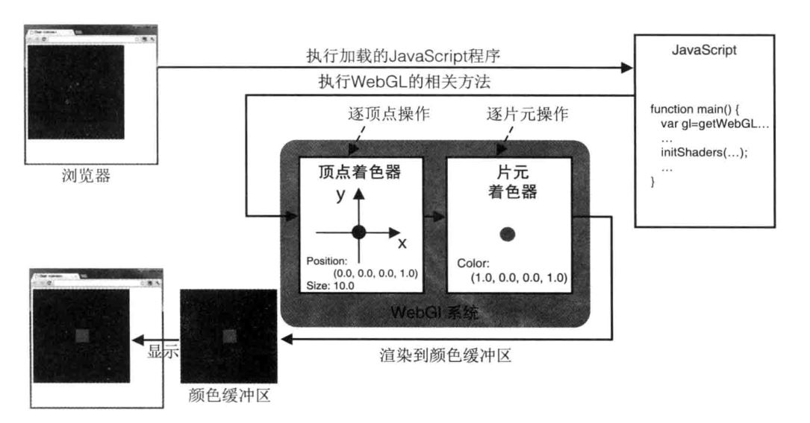
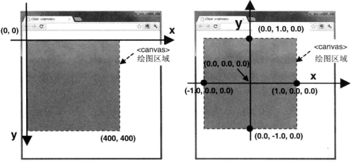

# WEBGL 简易教程

文档内容大部分(源码)引自[ charlee41.WebGl简易教程.[ol ].https://www.cnblogs.com/charlee44/p/12005301.html.2019-12-08]
文档中表格和图来自书籍《webgl编程指南》，[在线阅读](https://max.book118.com/html/2019/0103/7042124050001201.shtm) [下载(含示例代码)](https://www.jb51.net/books/494333.html#downintro2)

# 概述

- 参考书籍
- openGl 编程指南 第七版（红宝书）从固定管线开始
- openGl 编程指南 第八版（白皮书）从可编程管线开始

# 简单示例 绘制一个点

```html
<body onload="main()">
  <canvas id="webgl" width="400" height="400">
    Please use a browser that supports "canvas"
  </canvas>

  <!-- 《WebGL编程指南》中的源码 -->
  <script src="../lib/webgl-utils.js"></script>
  <script src="../lib/webgl-debug.js"></script>
  <script src="../lib/cuon-utils.js"></script>

  <script>
    // 顶点着色器程序
    var VSHADER_SOURCE =
      "void main() {\n" +
      "  gl_Position = vec4(0.0, 0.0, 0.0, 1.0);\n" + // Set the vertex coordinates of the point
      "  gl_PointSize = 10.0;\n" + // Set the point size
      "}\n";

    // 片元着色器程序
    var FSHADER_SOURCE =
      "void main() {\n" +
      "  gl_FragColor = vec4(1.0, 0.0, 0.0, 1.0);\n" + // Set the point color
      "}\n";

    function main() {
      // 获取 <canvas> 元素
      var canvas = document.getElementById("webgl");

      // 获取WebGL渲染上下文
      var gl = getWebGLContext(canvas);
      if (!gl) {
        console.log("Failed to get the rendering context for WebGL");
        return;
      }

      // 初始化着色器
      if (!initShaders(gl, VSHADER_SOURCE, FSHADER_SOURCE)) {
        console.log("Failed to intialize shaders.");
        return;
      }

      // 指定清空<canvas>的颜色
      gl.clearColor(0.0, 0.0, 0.0, 1.0);

      // 清空<canvas>
      gl.clear(gl.COLOR_BUFFER_BIT);

      // 绘制一个点
      gl.drawArrays(gl.POINTS, 0, 1);
    }
  </script>
</body>
```

## 准备工作

获取文档对象和 webgl 上下文
document.getElementById('webgl')：文档对象模型 DOM 的函数，获取到 HTML 页面的`<canvas>`元素。
getWebGLContext(canvas)：获取 WebGL 渲染上下文，保存在 gl 变量中。因为不同浏览器获取函数不太一样，所以通过组件 cuon-utils 提供的函数来统一行为。

## 着色器

initShaders:初始化着色器

在固定管线中，绘制点就是 drawPoint，绘制线就是 drawLine
在 webGL 中，绘制工作则主要被分解成顶点着色器和片元着色器两 blog\javascript\webgl_images 个步骤

js 程序启动后，绘制工作首先进入的是顶点着色器，在顶点着色器中描述顶点特性（位置，颜色等）,顶点就是三维空间的点
然后进入片元着色器，逐片元处理像素（光照，阴影，遮挡）最后片元传入到颜色缓冲区，经行显示



## 顶点着色器

```js
// 顶点着色器程序
var VSHADER_SOURCE =
  "void main() {\n" +
  "  gl_Position = vec4(0.0, 0.0, 0.0, 1.0);\n" + // Set the vertex coordinates of the point
  "  gl_PointSize = 10.0;\n" + // Set the point size
  "}\n";
```

前面说到顶点着色器程序是嵌入在JS中的程序，所以虽然传入的是字符串，但其实本质是着色器描述语言（GLSL:OpenGL Shading Language）。既然是语言也就有自己的函数与变量定义。`main()`函数是每个着色器程序定义的入口。在main函数中，将顶点的坐标赋值给内置变量gl_Position,点的尺寸赋值给内置变量gl_PointSize。

注意这里的gl_Position是必须赋值的，否则着色器不会正常工作。赋值的类型是vec4，也就是一个四维矢量。一般来说，描述点位只需要三维矢量就可以了，但是很多情况下需要四个分量的齐次坐标。齐次坐标（x,y,z,w）等价于三维坐标（x/w,y/w,z/w）。所以如果第四个分量是1，那么就是普通的三维坐标；如果第四分量为0，就表示无穷远的点。

## 片元着色器

```js
// 片元着色器程序
var FSHADER_SOURCE =
  "#ifdef GL_ES\n"+
  "precision mediump float;\n"+
  "#endif\n"+
  "void main() {\n" +
  "  gl_FragColor = vec4(1.0, 0.0, 0.0, 1.0);\n" + // Set the point color
  "}\n";
```

这几行代码非常简单，不过也能立即推断出一些知识点,《The Book of Shaders》中有介绍到:

1. shader 语言 有一个 main 函数，会在最后返回颜色值。这点和 C 语言很像。

2. 最终的像素颜色取决于预设的全局变量 gl_FragColor。

3. 这个类 C 语言有内建的变量（像gl_FragColor），函数和数据类型。在本例中我们刚刚介绍了vec4（四分量浮点向量）。之后我们会见到更多的类型，像 vec3 （三分量浮点向量）和 vec2 （二分量浮点向量），还有非常著名的：float（单精度浮点型）， int（整型） 和 bool（布尔型）。

4. 如果我们仔细观察 vec4 类型，可以推测这四个变元分别响应红，绿，蓝和透明度通道。同时我们也可以看到这些变量是规范化的，意思是它们的值是从0到1的。之后我们会学习如何规范化变量，使得在变量间map（映射）数值更加容易。

5. 另一个可以从本例看出来的很重要的类 C 语言特征是，预处理程序的宏指令。宏指令是预编译的一部分。有了宏才可以 #define （定义）全局变量和进行一些基础的条件运算（通过使用 #ifdef 和 #endif）。所有的宏都以 # 开头。预编译会在编译前一刻发生，把所有的命令复制到 #defines 里，检查#ifdef 条件句是否已被定义， #ifndef 条件句是否没有被定义。在我们刚刚的“hello world!”的例子中，我们在第2行检查了 GL_ES 是否被定义，这个通常用在移动端或浏览器的编译中。

6. float类型在 shaders 中非常重要，所以精度非常重要。更低的精度会有更快的渲染速度，但是会以质量为代价。你可以选择每一个浮点值的精度。在第一行（precision mediump float;）我们就是设定了所有的浮点值都是中等精度。但我们也可以选择把这个值设为“低”（precision lowp float;）或者“高”（precision highp float;）。

7. 最后可能也是最重要的细节是，GLSL 语言规范并不保证变量会被自动转换类别。这句话是什么意思呢？显卡的硬件制造商各有不同的显卡加速方式，但是却被要求有最精简的语言规范。因而，自动强制类型转换并没有包括在其中。在我们的“hello world!”例子中，vec4 精确到单精度浮点，所以应被赋予 float 格式。但是如果你想要代码前后一致，不要之后花费大量时间 debug 的话，最好养成在 float 型数值里加一个 . 的好习惯。如下这种代码就可能不能正常运行[ 1]

[1: Patricio Gonzalez Vivo,Jen Lowe.The Book of Shaders[ ol].https://thebookofshaders.com/02/?lan=ch .2015]

## 清空缓冲区
gl.clearColor()：设置清空的背景色。
gl.clear(gl.COLOR_BUFFER_BIT)： 清空颜色缓冲区。

## 绘制操作
gl.drawArrays(gl.POINTS, 0, 1):绘制一个点。
顶点着色器只是指定了绘制的顶点，还需要指定顶点到底成点、成线还是成面，gl.drawArrays()就是这样一个函数，这里告诉WebGL系统应该绘制一个点。

# 向着色器传输数据

上一个示例中数据内容都是写死的，实际中代码不会这样，我们来改进一下

```js
// 顶点着色器程序
var VSHADER_SOURCE =
  'attribute vec4 a_Position;\n' + // attribute variable
  'void main() {\n' +
  '  gl_Position = a_Position;\n' + // Set the vertex coordinates of the point
  '  gl_PointSize = 10.0;\n' +                    // Set the point size
  '}\n';

// 片元着色器程序
var FSHADER_SOURCE =
  'precision mediump float;\n' +
  'uniform vec4 u_FragColor;\n' +  // uniform変数
  'void main() {\n' +
  '  gl_FragColor = u_FragColor;\n' + // Set the point color
  '}\n';

function main() {
  // 获取 <canvas> 元素
  var canvas = document.getElementById('webgl');

  // 获取WebGL渲染上下文
  var gl = getWebGLContext(canvas);
  if (!gl) {
    console.log('Failed to get the rendering context for WebGL');
    return;
  }

  // 初始化着色器
  if (!initShaders(gl, VSHADER_SOURCE, FSHADER_SOURCE)) {
    console.log('Failed to intialize shaders.');
    return;
  }

  // 获取attribute变量的存储位置
  var a_Position = gl.getAttribLocation(gl.program, 'a_Position');
  if (a_Position < 0) {
    console.log('Failed to get the storage location of a_Position');
    return;
  }

  // 将顶点位置传输给attribute变量
  gl.vertexAttrib3f(a_Position, 0.5, 0.5, 0.0);

  //获取u_FragColor变量的存储地址
  var u_FragColor = gl.getUniformLocation(gl.program, 'u_FragColor');
  if (!u_FragColor) {
    console.log('Failed to get the storage location of u_FragColor');
    return;
  }

  //将点的颜色传入到u_FragColor变量中
  gl.uniform4f(u_FragColor, 0.0, 0.8, 0.0, 1.0);

  // 指定清空<canvas>的颜色
  gl.clearColor(0.0, 0.0, 0.0, 1.0);

  // 清空<canvas>
  gl.clear(gl.COLOR_BUFFER_BIT);

  // 绘制一个点
  gl.drawArrays(gl.POINTS, 0, 1);
}
```

你很快就会注意到顶点着色器的代码中多了`attribute`,片元着色器中多了`uniform`,他们是向着色器传递数据用的，《The Book of Shaders》有介绍如下

>尽管每个线程和其他线程之间不能有数据交换，但我们能从 CPU 给每个线程输入数据。因为显卡的架构，所有线程的输入值必须统一（uniform），而且必须设为只读。也就是说，每条线程接收相同的数据，并且是不可改变的数据。这些输入值叫做 uniform （统一值），它们的数据类型通常为：float, vec2, vec3, vec4, mat2, mat3, mat4, sampler2D and samplerCube。uniform 值需要数值类型前后一致。且在 shader 的开头，在设定精度之后，就对其进行定义。[ 2]

[2: Patricio Gonzalez Vivo,Jen Lowe.The Book of Shaders[ ol].https://thebookofshaders.com/03/?lan=ch .2015]

uniform是连接gpu和cpu的桥梁，但是单靠uniform还不够，glsl有三种变量类型，分别是`uniform`，`attribute`和`varying`,单从符号来说，它们叫存储限定符

## uniform变量

表示JavaScript程序向顶点着色器和片元着色器传输的一致的(不变的)数据

uniform变量是外部程序传递给（vertex和fragment）shader的变量。因此它是application通过函数glUniform4f（）函数赋值的。在（vertex和fragment）shader程序内部，uniform变量就像是C语言里面的常量（const ），它不能被shader程序修改。（shader只能用，不能改）。如果uniform变量在vertex和fragment两者之间声明方式完全一样，则它可以在vertex和fragment共享使用。（相当于一个被vertex和fragment shader共享的全局变量）。uniform变量一般用来表示：变换矩阵，材质，光照参数和颜色等信息。

## attribute变量
表示的是与顶点相关的数据，只能用在顶点着色器中。这个变量存储了从外部传输进顶点着色器的数据。

attribute变量是只能在vertex shader中使用的变量。（它不能在fragment shader中声明attribute变量，也不能被fragment shader中使用）。一般用attribute变量来表示一些顶点的数据，如：顶点坐标，法线，纹理坐标，顶点颜色等。在application中，一般用函数glBindAttribLocation（）来绑定每个attribute变量的位置，然后用函数glVertexAttribPointer（）为每个attribute变量赋值。

## varying变量

表示的是从顶点着色器流向片元着色器可变的变量。

varying变量是vertex和fragment shader之间做数据传递用的。一般vertex shader修改varying变量的值，然后fragment shader使用该varying变量的值。因此varying变量在vertex和fragment shader二者之间的声明必须是一致的。application不能使用此变量。[ 3]

[3: wo不懂.GLSL 三种变量类型（uniform，attribute和varying）理解[ ol].https://www.jianshu.com/p/eed3ebdad4fb .2017-07-19]

# 通过鼠标点击绘点

到现在为止能够从javascript向顶点着色器传输点的位置但是点的坐标还是硬编码的 // todo

## 浏览器客户区中的坐标和canvas中的坐标

《webgl编程指南》原书中在绘制一个点后有一个示例是讲的用鼠标绘制点，其中有讲坐标系，如图所示很简单



# 缓冲区对象

在函数 initVertexBuffers()中，可以看到首先初始化了一个 JavaScript 数组(Float32Array 是 WebGL 引入的特殊的类型化数组，能够保存大量同一种类型的元素),它就是缓冲区需要写入的数据：

```js
var vertices = new Float32Array([0, 0.5, -0.5, -0.5, 0.5, -0.5]);
```

### 创建缓冲区对象(gl.createBuffer())

webGL 通过 gl.createBuffer()来创建缓冲区对象，它告诉 webgl 系统，开辟显存空间接受内存传输过来的数据

| 创建缓冲区对象 |         |                    |
| -------------- | ------- | ------------------ |
| 返回值         | 非 null | 新创建的缓冲区对象 |
| 返回值         | null    | 创建缓冲区对象失败 |
| 错误           | 无      |                    |

### 绑定缓冲区对象(gl.bindBuffer())

**缓冲区对象可能有多种用途**创建缓冲区之后还需将其绑定到不同目标上，参数 gl.ARRAY_BUFFER 表示缓冲区对象存储的是有关顶点的数据。其绑定函数 gl.bindBuffer()的具体说明如下

| gl.bindBUffer(target,buffer) |                               | 允许使用 buffer 表示的缓冲区对象并将其绑定到 target 表示的目标上                              |
| ---------------------------- | ----------------------------- | --------------------------------------------------------------------------------------------- |
| 参数                         | target 参数可以是以下中的一个 |                                                                                               |
| 参数                         | gl.ARRAY_BUFFER               | 表示缓冲区对象中包含了顶点的数据                                                              |
| 参数                         | gl.ELEMENT_ARRAY_BUFFER       | 表示缓冲区对象中包含了顶点的索引值                                                            |
| 参数                         | buffer                        | 指定之前由 gl.createBuffer()返回的待绑定的缓冲区对象，如果指定为 null，则禁用对 target 的绑定 |
| 返回值                       | 无                            |                                                                                               |
| 错误                         | INVALID_ENUM                  | target 不是上述值之一，这时将保持原有的绑定情况不变                                           |

### 将缓冲区对象分配给 attribute 变量(gl.vertexAttribPointer())

```js
var a_Position = gl.getAttribLocation(gl.program, "a_Position");
if (a_Position < 0) {
  console.log("Failed to get the storage location of a_Position");
  return -1;
}
// 将缓冲区对象分配给a_Position变量
gl.vertexAttribPointer(a_Position, 2, gl.FLOAT, false, 0, 0);
```

这里用函数 gl.vertexAttribPointer 将整个缓冲区对象，也就是顶点数据，一次性分配给 attribute 变量 a_Position

| gl.vertexAttribPointer(location,size,type,normallized,stride,offset) |                   | 将绑定到 gl.ARRAY_BUFFER 的缓冲区对象分配给由 location 指定的 attribute 变量                                                                                                                       |
| -------------------------------------------------------------------- | ----------------- | -------------------------------------------------------------------------------------------------------------------------------------------------------------------------------------------------- |
| 参数                                                                 | location          | 指定待分配 attribute 变量的存储位置                                                                                                                                                                |
|                                                                      | size              | 指定缓冲区中每个顶点的分量大小(1-4)，若 size 比 attribute 变量需要的分量数小，缺失分量将按照与 gl.vertexAttrib[ 1234]f()相同的规则不全，比如，如果 size 为 1,那么 2,3 分量自动设为 0，第四分量为 1 |
|                                                                      | type              | 用以下类型之一来指定数据格式                                                                                                                                                                       |
|                                                                      | gl.UNSIGNED_BYTE  | 无符号字节 Uint8Array                                                                                                                                                                              |
|                                                                      | gl.SHORT          | 短整型 Int16Array                                                                                                                                                                                  |
|                                                                      | gl.UNSIGNED_SHORT | 无符号短整型                                                                                                                                                                                       |
|                                                                      | gl.INT            | 整型 Int32Array                                                                                                                                                                                    |
|                                                                      | gl.UNSIGNED_INT   | 无符号整型                                                                                                                                                                                         |
|                                                                      | gl.FLOAT          | 浮点型                                                                                                                                                                                             |
|                                                                      | normallized       | 传入 true 或 false 表明是否将非浮点型的数据归一化到[ 0,1]或[ -1,1]区间                                                                                                                             |
|                                                                      | stride            | 指定相邻的两个顶点间的字节数，默认为 0                                                                                                                                                             |
|                                                                      | offset            | 指定缓冲区对象中的偏移量(以字节为单位)即 attribute 变量从缓冲区中的何处开始存储，如果是从其实位置开始的，offset 设为 0                                                                             |
| 返回值                                                               | 无                |                                                                                                                                                                                                    |
| 错误                                                                 | INVALID_OPERATION | 不存在当前程序对象                                                                                                                                                                                 |
|                                                                      | INVALID_VALUE     | location 大于等于 attribute 变量的最大数目(默认为 8)。或者 stride 或 offset 是负值                                                                                                                 |

### 开启 attribute 变量（gl.enableVertexAttribArray()

```js
// 连接a_Position变量与分配给它的缓冲区对象
gl.enableVertexAttribArray(a_Position);
```

最后一步就非常简单了，开启 attributeb 变量,建立缓冲区与 attribute 变量的连接

| gl.enableVertexAttribArray(location) |               | 开启 location 指定的 attribute 变量                    |
| ------------------------------------ | ------------- | ------------------------------------------------------ |
| 参数                                 | location      | 指定 attribute 变量的存储位置                          |
| 返回值                               | 无            |                                                        |
| 错误                                 | INVALID_VALUE | location 大于等于 attribute 变量的最大数目（默认为 8） |

通过以上五个步骤，着色器就可以根据缓冲区对象的数据惊醒正确的绘制了，其示意图如下


## 基本图形绘制

```js
// 绘制三角形
gl.drawArrays(gl.TRIANGLES, 0, 3);
```

gl.drawArrays()函数说明如下

| gl.drawArrays(mode,first,count) |       | 执行顶点着色器，按照 mode 参数指定的方式绘制图形                                                                                         |
| ------------------------------- | ----- | ---------------------------------------------------------------------------------------------------------------------------------------- |
| 参数                            | mode  | 指定绘制的方式的方式，可接受以下常量符号：gl.POINTS,gl.LINES,gl.LINE_STRIP,gl.LINE_LOOP,gl.TRIANGLES,gl.TRIANGLES_SRTIP,gl.TRIANGLES_FAN |
|                                 | first | 指定从哪个顶点开始绘制(整形数)                                                                                                           |
|                                 | count | 指定绘制选哟用到多少个顶点(整型数)                                                                                                       |

第二个参数和第三个参数非常简单，表示从哪个顶点数据绘制到哪个顶点数据。例如这里绘制三角形表示从第 1 个点绘制到第 3 个点。

第一个参数表示可以绘制的 7 种基本图形


基本示意图如下


# 向着色器传输数据

## attribute 变量

attribute 是 glsl 中三种变量声明之一，代表的是与顶点相关的数据，只能用在顶点着色器中。这个变量存储了从外部传输进顶点着色器的数据。

在 shader 中定义好 attribute 变量之后，还需要通过 JS 与 shader 进行交互，通过 webgl 的渲染上下文变量 gl,可以得到获取 attribute 变量的存储地址的方法 getAttribLocation()，其定义如下：

| gl.getAttribLocation(program,name) |                   | 获取由 name 参数定义的 attribute 变量的存储地址               |
| ---------------------------------- | ----------------- | ------------------------------------------------------------- |
| 参数                               | program           | 指定包含顶点着色器和片元着色器的着色器程序对象                |
|                                    | name              | 指定想要获取其存储地址的 attribute 变量的名称                 |
| 返回值                             | 大于等于 0        | attribute 变量的存储地址                                      |
|                                    | -1                | 指定 attribute 变量不存在，或者其命名具有 gl 或 webgl 前缀    |
| 错误                               | INVALID_OPERATION | 程序未能成功连接                                              |
|                                    | INVALID_VALUE     | name 参数的长度大于 attribute 变量名的最大长度，默认 256 字节 |

获取到地址之后可以向 attribute 变量传送数据，使用`gl.vertexAttrib3f()`函数来向着色器传入值

## uniform 変量

uniform 是 glsl 中另外一种变量声明，表示的是 JavaScript 程序向顶点着色器和片元着色器传输的一致的(不变的)数据；也就是是说这种变量既可以用在顶点着色器也可以用于片元着色器。
